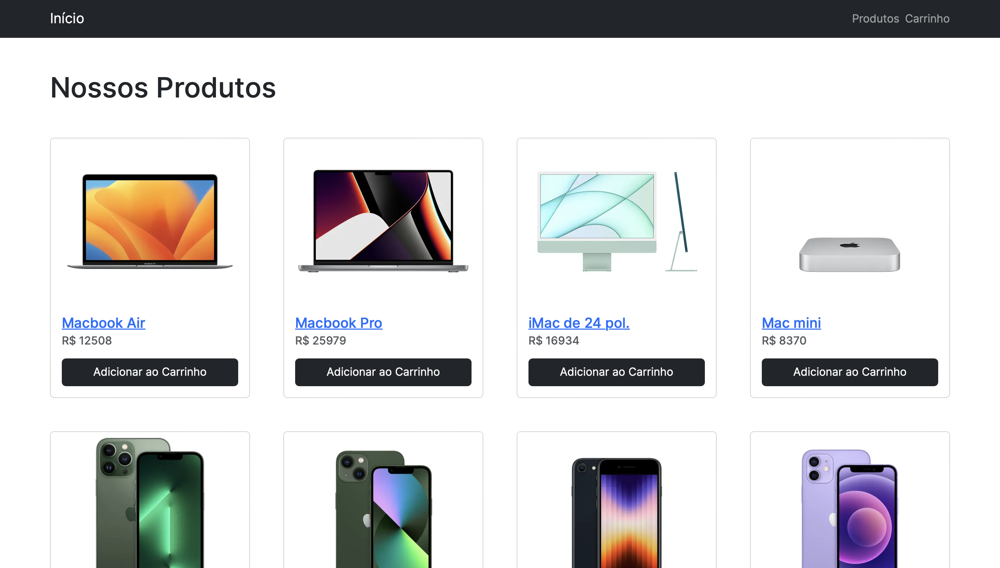
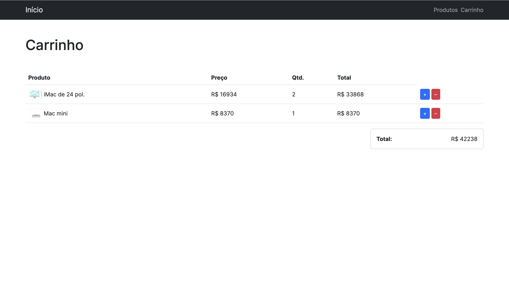

<h1>Ecommerce</h1>

> Project Status: Finished (August 04, 2023)

### Topics

:small_blue_diamond: [Project Description](#project-description)

:small_blue_diamond: [Features](#features)

:small_blue_diamond: [Dependencies](#dependencies)

:small_blue_diamond: [Run App](#run-application)

## Project Description

<p align="justify">
  Ecommerce page to practice use of NextJS. This was my first project using NextJS (with PagesRouter and also with AppRouter).
  TypeScript and BootStrap were also used to develop the application.
</p>

## Features

:heavy_check_mark: See products. Add, remove and view products in cart, total products and total price.

## Dependencies

:warning: Node
<br>
:warning: TypeScript
<br>
:warning: BootStrap
<br>
:warning: ReactStrap





## Run application:

Clone project:

```
git clone https://github.com/EnzoBozzani/ecommerce.git
```

Install dependencies:

```
npm install
```

Run project:

```
npm run dev
```
